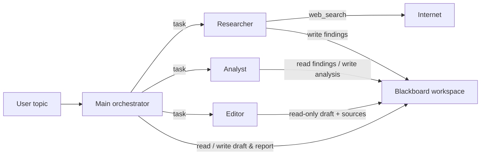
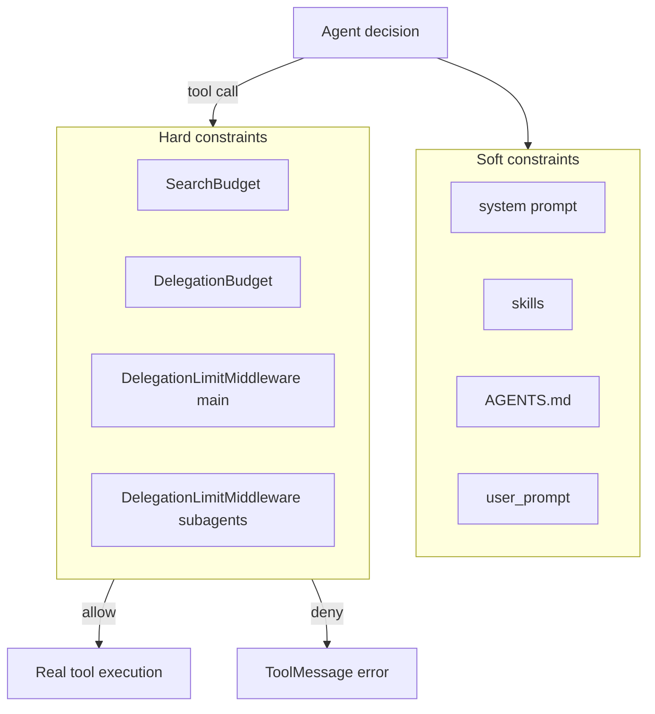
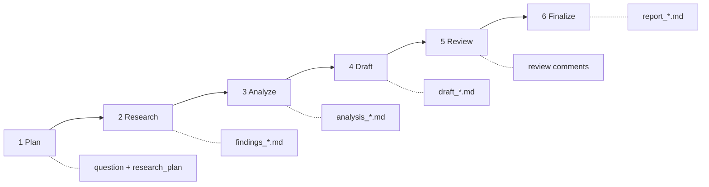

# Deep Research Assistant

> [English](./README.md) | [中文](./README.zh.md)

A multi-agent deep research assistant built on official [DeepAgents](https://github.com/langchain-ai/deepagents). Given a research topic, it runs planning → web research → structured analysis → drafting → editorial review → final report, with an auditable, constrained, and reproducible pipeline. Output language follows the user’s query (Chinese → Chinese, English → English).

---

## Overview

**Deep Research Assistant** is a Multi-Agent application for complex research tasks. For a topic such as “Compare LangGraph and AutoGen”, it automatically plans, searches the web, analyzes findings, drafts a report, reviews it, and finalizes delivery under `workspace/`.

Unlike one-shot ChatGPT Q&A, this project treats research as an **auditable production pipeline**: each stage has a clear owner, fixed artifacts, and hard call limits—reducing spinning loops, repeated searches, and rewriting the same materials.

---

## Architecture

The goal is to turn one deep-research run into a stable, auditable, constrained Agent pipeline.

### 1. Design: Orchestrator + Specialists + Blackboard

A real research team has a project lead (orchestration) and specialists (execution). This project mirrors that:

| Role | Agent | Responsibility |
|------|-------|----------------|
| **Orchestrator** | Main agent | Decompose, delegate, read materials, draft, finalize report |
| **Researcher** | `researcher` | Focused web research for one subtopic; write findings |
| **Analyst** | `analyst` | Read findings; structured comparison / numeric analysis |
| **Editor** | `editor` | Review the draft; return comments only (no direct rewrites) |

**Key pattern: Blackboard**

Sub-agents **do not share chat history**. They exchange information via Markdown files under `workspace/`:



Why:

- **Auditable**: every stage leaves files you can inspect  
- **Parallelizable**: multiple researchers can work on different subtopics  
- **Contamination-resistant**: main agent should not rewrite findings/analysis after specialists finish  
- **Testable**: middleware can assert path/write rules deterministically  

---

### 2. Tech choices: what and why

| Tech / tool | Role in this system | Why |
|-------------|---------------------|-----|
| **[DeepAgents](https://github.com/langchain-ai/deepagents)** `create_deep_agent` | Runtime: main + subagents + file tools + skills | Official orchestration stack with virtual FS; aligned with Deep Research learning goals |
| **LangGraph** (under DeepAgents) | Stateful agent loop; `astream_events` observability | Event stream is better than a single `ainvoke` for debugging “how many searches / what was written” |
| **LangChain `AgentMiddleware`** | Intercept tool calls before execution (`wrap_tool_call`) | Prompts only *suggest*; middleware can **hard-deny** runaway tool use |
| **`FilesystemBackend` (`virtual_mode`)** | `read_file` / `write_file` / `edit_file` / `ls` | Persist research notes; map paths under `/workspace/...` safely |
| **OpenAI-compatible LLM** (default `gpt-4.1-mini`) | Reasoning & generation for all agents | Switch model / `max_input_tokens` via `.env`; comparison tasks need long context |
| **Bocha `web_search`** | Web retrieval with source URLs | Simple API; works well as a LangChain `@tool` for research workflows |
| **`SearchBudget`** | Shared search-call cap per run (default 6) | Agents rewrite similar queries; budget exhaustion is cheaper than unbounded API spend |
| **`structured_calculator`** | Ranking / ratios / numeric ops for analyst | Keeps numeric conclusions reproducible instead of LLM “mental math” |
| **`skills/`** | Scenario guides (`web-research`, `report-writer`) | Moves long process text out of the system prompt |
| **`AGENTS.md`** | Long-lived project norms | DeepAgents memory injection for stable global rules |
| **`prompts.py` + `user_prompt`** | Soft constraints per run | Topic-specific “do not …” rules |
| **LangSmith** | Trace tool/model calls | Local events for live debug; LangSmith for post-hoc long traces |
| **`pytest` contracts** | Prompt / subagent / middleware rules | Agent systems are hard to unit-test; lock deterministic contracts |

---

### 3. Collaboration: soft + hard dual control

Prompt-only control is not enough in real runs. Architecture uses two layers:



| Type | Mechanism | Typical blocks |
|------|-----------|----------------|
| **Soft** | Prompt / Skills / Memory | “analyst at most once”, “ls before read”, lowercase filenames |
| **Hard** | Middleware + budget counters | 2nd analyst/editor; main rewrites findings; root `/findings_x.md`; 7th web_search |

**Why two middleware instances?**

DeepAgents middleware wraps **only the agent it is attached to**, not subagents automatically:

- **`path_guard`** on `researcher` / `analyst`: allow writing findings/analysis, but enforce `/workspace/sources/` + lowercase slug  
- **`main_guard`** on the main agent: block rewriting findings/analysis; limit `task` delegations  

Result: **subagents can write; main cannot overwrite**—preventing overwrite → missing file → re-delegation loops.

---

### 4. Lifecycle of one research run

Six stages, each with a unique writer and fixed artifacts:



| Stage | Actor | Core tools | Artifact |
|-------|-------|------------|----------|
| Plan | Main | `write_file`, `write_todos` | `question.txt`, `research_plan.md` |
| Research | `researcher` | `web_search`, `write_file` | `findings_<slug>.md` |
| Analyze | `analyst` | `read_file`, `structured_calculator`, `write_file` | `analysis_<slug>.md` |
| Draft | Main | `read_file`, `write_file` | `draft_<slug>.md` |
| Review | `editor` | `read_file` (read-only) | review text (not the report file) |
| Finalize | Main | `edit_file`, `write_file` | `report_<slug>_<date>.md` |

Workspace artifacts from previous runs are cleared at start so agents do not reuse stale findings.

---

### 5. Key engineering decisions

1. **Not one mega-agent** — research / analysis / review need different prompts and tool scopes.  
2. **Editor does not rewrite the report** — comments in, author revises; clearer ownership.  
3. **Filename convention + hard validation** — blocks `*_research.md` / CamelCase path hallucinations.  
4. **Shared search budget** — one counter for main + all researchers.  
5. **Event stream + JSON metadata** — live `[event]` logs for debug; `--json` for automated closure checks.

---

### What problem does it solve?

Producing a sourced, structured research report with analysis and limitations usually means:

1. Split sub-questions and write a plan  
2. Search and organize findings  
3. Compare / compute  
4. Draft, review, finalize  

Automation often fails via infinite search, duplicate delegation, wrong paths, or overwriting specialist outputs. This project hardens the flow with **orchestrator + specialists + file workspace + hard middleware limits**.

### Core capabilities

| Capability | Description |
|------------|-------------|
| **Multi-agent collaboration** | Main orchestrates; `researcher` / `analyst` / `editor` specialize |
| **Official DeepAgents runtime** | `create_deep_agent`, virtual FS, `skills/`, `AGENTS.md` |
| **Web search** | Bocha `web_search` with shared budget (default max 6) |
| **File-driven workflow** | Artifacts under `workspace/sources/` and `workspace/reports/` |
| **Hard anti-runaway limits** | Delegation caps, protected findings/analysis, path/filename checks |
| **Language follows user** | Chinese query → Chinese report; English query → English report |

### Typical artifacts

```
workspace/
├── sources/
│   ├── question.txt
│   ├── research_plan.md
│   ├── findings_<slug>.md
│   └── analysis_<slug>.md
└── reports/
    ├── draft_<slug>.md
    └── report_<slug>_<date>.md
```

Filenames must use **lowercase ASCII slugs** (e.g. `findings_langgraph.md`).

### Stack

- **Python 3** + `langchain` / `langgraph` / `deepagents`
- **Model**: OpenAI-compatible API (default `gpt-4.1-mini` via `.env`)
- **Search**: Bocha Web Search API
- **Observability**: optional LangSmith
- **Tests**: pytest contracts + manual guard script + live CLI regression

---

## Quick start

### 1. Environment

- Python 3.10+ (3.11 / 3.12 recommended)
- OpenAI-compatible API key
- [Bocha](https://open.bochaai.com/) API key

```bash
cd Deep_Research_Assistant
python3 -m venv .venv
source .venv/bin/activate
```

### 2. Install

```bash
pip install -U pip
pip install deepagents langchain langchain-openai langgraph langchain-core \
  python-dotenv pydantic httpx pytest
```

### 3. Configure env

```bash
# English template (default)
cp .env_template .env

# Or Chinese-commented template
# cp .env_template.zh .env
```

Fill in `OPENAI_API_KEY` and `BOCHA_API_KEY` (both required at startup). See comments in the template.

### 4. Run a research job

```bash
# Text output (Chinese topic → Chinese report)
PYTHONPATH=. python -m src.main "对比 LangGraph 与 AutoGen"

# English topic → English report
PYTHONPATH=. python -m src.main "Compare LangGraph and AutoGen"

# JSON (+ search_calls / analyst_calls metadata)
PYTHONPATH=. python -m src.main "Compare LangGraph and AutoGen" --json

# Skip analyst
PYTHONPATH=. python -m src.main "Compare LangGraph and AutoGen" --no-analysis
```

A full run may take several minutes and consumes LLM + search quota. Watch `[event] tool_start` / `tool_end` logs.

### 5. Inspect outputs

```bash
ls workspace/sources/
ls workspace/reports/
```

Expect:

```text
workspace/sources/
  question.txt
  research_plan.md
  findings_*.md
  analysis_*.md          # unless --no-analysis

workspace/reports/
  draft_*.md
  report_*_YYYY-MM-DD.md
```

### 6. Unit tests (optional, no API)

```bash
PYTHONPATH=. python -m pytest tests/test_deepagents_contracts.py -q
PYTHONPATH=. python tests/manual_test_delegation_guard.py
```

---

## Testing & regression

Two layers: **API-free contract/guard tests**, and **live API regression**.

### 1. Unit / contract tests (run after code changes)

```bash
source .venv/bin/activate
PYTHONPATH=. python -m pytest tests/test_deepagents_contracts.py -q
PYTHONPATH=. python tests/manual_test_delegation_guard.py
```

| Area | What it checks |
|------|----------------|
| Skills / Memory | `web-research`, `report-writer`, `AGENTS.md` |
| Prompt contracts | Orchestration, `--no-analysis`, anti-loop, no user confirmation |
| Subagent wiring | With/without analyst; tool bindings |
| Search budget | `SearchBudget` / limited `web_search` |
| Calculator | Reproducible ranking |
| Middleware | Blocks 2nd analyst/editor; blocks main writes to findings/analysis |
| Paths / filenames | Rejects root `/findings_*.md` and CamelCase; allows sources paths |
| Wiring | `path_guard` only on researcher/analyst |

### 2. Live regression (after guard/flow changes)

```bash
PYTHONPATH=. python -m src.main "Compare LangGraph and AutoGen" --json
```

Checklist:

| Check | Expect |
|-------|--------|
| `workspace/sources/` | `question.txt`, `research_plan.md`, ≥1 `findings_*.md` |
| `analysis_*.md` | Present unless `--no-analysis` |
| `workspace/reports/` | `draft_*.md` and `report_*_<run_date>.md` |
| Filenames | Lowercase slug; no `*_research.md`; no root artifacts |
| `analyst_calls` | Usually `1` for comparison topics |
| `editor_calls` | Usually `1` |
| `search_calls` | ≤ `search_call_limit` (default 6) |
| Logs | `[guard] blocked ...` is OK; endless spinning is not |

---

## CLI

Entry: `python -m src.main`

| Arg | Type | Default | Description |
|-----|------|---------|-------------|
| `topic` | positional (required) | — | Research topic |
| `--json` | flag | `false` | JSON output with metadata |
| `--no-analysis` | flag | `false` | Skip analyst stage |
| `--mode` | enum | `deepagents` | Only `deepagents` for now |

```bash
PYTHONPATH=. python -m src.main "Compare LangGraph and AutoGen"
PYTHONPATH=. python -m src.main "Compare LangGraph and AutoGen" --json
PYTHONPATH=. python -m src.main "Compare LangGraph and AutoGen" --no-analysis --json
PYTHONPATH=. python -m src.main "Compare LangGraph and AutoGen" --mode deepagents
```

Useful `--json` fields under `deepagents`:

- `search_calls` / `search_call_limit`
- `analyst_calls` / `analyst_call_limit`
- `editor_calls` / `editor_call_limit`
- `run_date`, `expected_report_glob`, `todos`

---

## Artifact conventions

Artifacts live at virtual `/workspace/...` (mapped to local `workspace/`).  
Previous run files are cleared at start (keeps `README.md` / `.gitkeep`).

### Directories

| Path | Purpose |
|------|---------|
| `workspace/sources/` | Question, plan, findings, analysis |
| `workspace/reports/` | Draft and final report |

### Naming (enforced)

`slug` = lowercase letters, digits, underscore (`[a-z0-9_]+`).

| Artifact | Template | Writer |
|----------|----------|--------|
| Question | `/workspace/sources/question.txt` | Main |
| Plan | `/workspace/sources/research_plan.md` | Main |
| Findings | `/workspace/sources/findings_<slug>.md` | `researcher` |
| Analysis | `/workspace/sources/analysis_<slug>.md` | `analyst` |
| Draft | `/workspace/reports/draft_<slug>.md` | Main |
| Report | `/workspace/reports/report_<slug>_<YYYY-MM-DD>.md` | Main |

Forbidden examples: `/findings_langgraph.md`, `findings_LangGraph.md`, `AutoGen_research.md`, main rewriting findings/analysis.

### Closure criteria

A complete run should include:

1. `question.txt`  
2. `research_plan.md`  
3. ≥1 `findings_*.md`  
4. `draft_*.md`  
5. `report_*_<run_date>.md`  

Plus `analysis_*.md` for comparison/numeric tasks (unless `--no-analysis`). Draft without report does **not** count as done.

---

## Highlights

1. **Orchestrator + specialized sub-agents** — clear roles, tools, and prompt boundaries.  
2. **Blackboard file state** — auditable, parallelizable, testable collaboration.  
3. **Soft + hard dual guardrails** — prompts guide; budgets/middleware enforce.  
4. **Hard path/filename validation** — blocks real failure modes from path hallucination.  
5. **Contract tests + live regression** — deterministic guards + end-to-end closure checks.  
6. **Official DeepAgents practice** — `create_deep_agent` + FS + skills + memory in a runnable sample.

---

## License

[MIT License](./LICENSE)

Copyright (c) 2026 Kuangdong Sun
