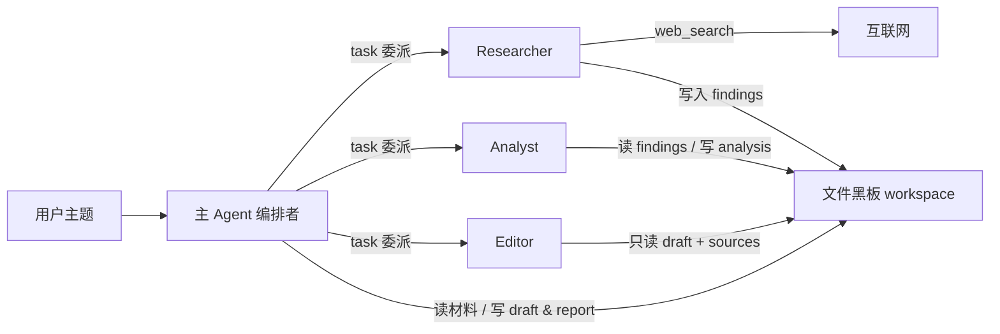
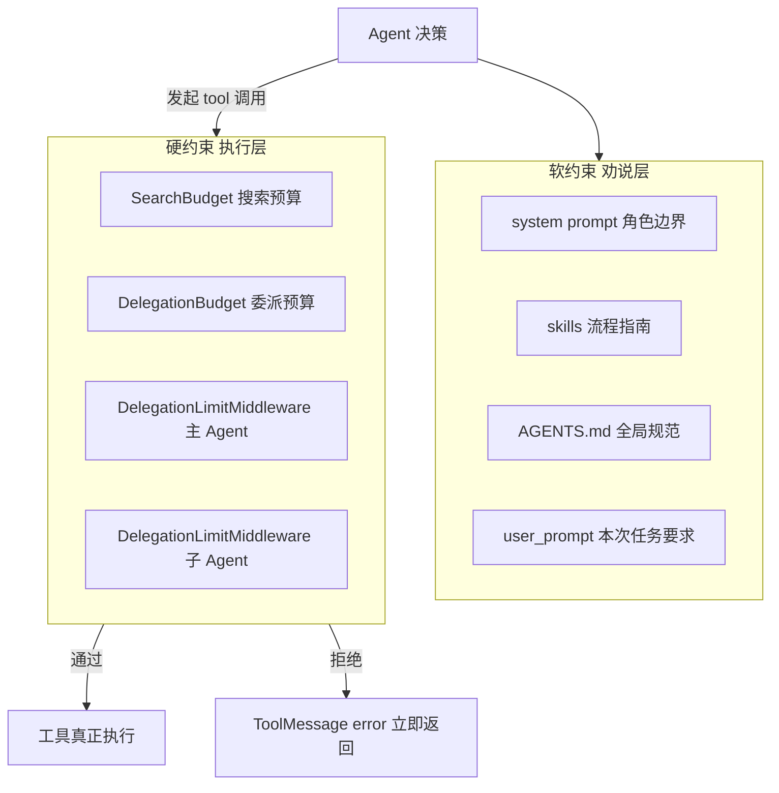
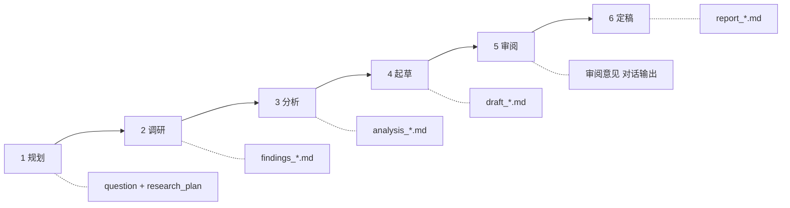

# Deep Research Assistant

> 基于官方 [DeepAgents](https://github.com/langchain-ai/deepagents) 的多 Agent 深度调研助手：从主题输入到结构化情报报告，全流程可追踪、可约束、可复现；输出语言跟随用户提问。

---

## 项目介绍

**Deep Research Assistant** 是一个面向复杂调研任务的 Multi-Agent 应用。根据给定研究主题（例如「对比 LangGraph 与 AutoGen」）自动完成规划、联网调研、结构化分析、报告起草、编辑审阅与定稿，最终在 `workspace/` 目录下产出完整的过程文件与最终报告。

与「单次问答式 ChatGPT」不同，本项目把调研当成一条**可审计的生产流水线**来设计：每个阶段有明确职责、固定产出文件、硬性调用上限，避免 Agent 空转、重复搜索、反复改写同一份材料。

---

## 架构设计

本项目的架构目标是把**一次深度调研**拆成一条稳定、可审计、可约束的 Agent 流水线。

下面从设计思路、技术选型、协作机制三方面说明系统是如何设计的。

### 1. 设计思路：编排者 + 专家 + 文件黑板

真实调研团队通常有一个**项目经理（编排）**和若干**专家（执行）**：调研员搜资料、分析师做对比、编辑审稿，最后由负责人定稿。  
本项目按同样思路建模：

| 角色 | 对应 Agent | 设计职责 |
|------|-----------|----------|
| **编排者** | 主 Agent | 拆题、委派、读材料、起草 draft、根据审阅意见定稿 report |
| **调研员** | `researcher` | 只负责一个子主题的联网搜索与 findings 落盘 |
| **分析师** | `analyst` | 只负责读取 findings、做结构化对比与必要数值计算 |
| **编辑** | `editor` | 只负责审阅 draft，输出修改意见，不直接改文件 |

**关键设计：Blackboard Pattern**

子 Agent 之间**不共享对话上下文**，只通过 `workspace/` 里的 Markdown 文件交换信息：



这样设计的原因：

- **可审计**：每个阶段的输入输出都是文件，能回溯「谁写了什么」  
- **可并行**：多个 researcher 可同时调研不同子主题  
- **防污染**：子 Agent 完成后，主 Agent 不应再改写 findings/analysis，避免覆盖专业产出后又触发重复委派  
- **可测试**：中间件和单元测试可以直接断言「某路径是否允许写入」

---

### 2. 技术选型：用什么 以及 为什么使用

| 技术 / 工具 | 在本系统中的作用 | 为什么选它 |
|------------|----------------|-----------|
| **[DeepAgents](https://github.com/langchain-ai/deepagents)** `create_deep_agent` | Agent 运行时：主 Agent + 子 Agent + 文件工具 + skills 一站式装配 | 官方封装了「编排型主 Agent + subagents + 虚拟文件系统」，避免从零搭 LangGraph 图；与教学目标（学习 Deep Research 模式）一致 |
| **LangGraph**（DeepAgents 底层） | 状态机式执行 Agent 循环；支持 `astream_events` 流式观测 | 需要看清 model/tool 事件来调试空转；事件流比单次 `ainvoke` 更适合排查「搜了几次、写了什么」 |
| **LangChain `AgentMiddleware`** | 在工具真正执行前拦截调用（`wrap_tool_call`） | Prompt 只能「建议」Agent 别乱搜、别重复委派；中间件能在**工具层硬拒绝**，把失控成本从「浪费 5 分钟」降到「立刻返回错误」 |
| **`FilesystemBackend`（virtual_mode）** | 给 Agent 提供 `read_file` / `write_file` / `edit_file` / `ls` | Agent 需要持久化调研笔记；虚拟模式把路径统一映射到 `/workspace/...`，避免 Agent 写穿真实磁盘 |
| **OpenAI 兼容 LLM**（默认 `gpt-4.1-mini`） | 主/子 Agent 的推理与生成 | 通过 `.env` 可切换模型与 `max_input_tokens`；对比类任务需要较长上下文读多份 findings |
| **Bocha `web_search`** | 联网检索事实与来源 URL | 项目面向中文调研场景；Bocha 对中文查询和摘要较友好，API 简单，适合封装为 LangChain `@tool` |
| **`SearchBudget` 包装搜索工具** | 整次运行共享搜索次数上限（默认 6 次） | 真实跑通过程中，Agent 容易对同一概念换词反复搜索；预算耗尽后直接返回提示，比无限 API 调用更可控 |
| **`structured_calculator`** | analyst 做排名、占比等数值计算 | LLM 容易「手算」或编造数字；把数值结论交给确定性工具，analysis 才可复现 |
| **`skills/` 技能包** | 分场景流程指南（`web-research`、`report-writer`） | 把「怎么调研、怎么写报告」从 system prompt 拆出去，主 Agent 按需加载，减少 prompt 臃肿 |
| **`AGENTS.md` 长期记忆** | 全局规范：语言跟随用户、证据诚信、输出结构 | DeepAgents 原生支持 memory 注入；适合放**长期不变**的项目级规则 |
| **`prompts.py` + `user_prompt`** | 运行时软约束：流程顺序、文件名约定、委派策略 | 每次运行的主题不同，需要把「本次任务禁止什么」写进 user 消息 |
| **LangSmith** | Trace 每次 tool/model 调用 | 本地 `astream_events` 看实时日志；LangSmith 适合事后分析长链路 |
| **`pytest` 单元测试** | 验证 prompt、子 Agent 结构、中间件拦截规则 | Agent 系统难做传统单元测试；对**可确定的契约**（路径规则、委派上限）做回归，防止改 prompt 后护栏失效 |

---

### 3. 协作机制：软约束 + 硬约束双轨控制

只靠 Prompt 告诉 Agent「别重复搜索、别改 findings」，在真实运行中**不够**。  
因此架构上采用**双轨控制**：



| 约束类型 | 实现方式 | 典型拦截场景 |
|---------|---------|-------------|
| **软约束** | Prompt / Skills / Memory | 「analyst 最多 1 次」「先 ls 再 read」「文件名全小写」 |
| **硬约束** | Middleware + Budget 计数器 | 第 2 次委派 analyst；主 Agent 改写 findings；写到 `/findings_x.md` 根路径；第 7 次 web_search |

**为什么中间件要挂两份？**

DeepAgents 的 middleware **只包裹挂载它的 Agent 的工具调用**，不会自动覆盖子 Agent。因此：

- **`path_guard`** 挂在 `researcher` / `analyst`：允许它们写 findings/analysis，但强制路径必须在 `/workspace/sources/` 且文件名为全小写 slug  
- **`main_guard`** 挂在主 Agent：禁止改写 findings/analysis，并限制 `task` 委派次数  

这实现了「**子 Agent 能写、主 Agent 不能改**」——避免主 Agent 覆盖子 Agent 成果后，又因读不到正确文件而重复委派。

---

### 4. 一次调研在系统中的生命周期

从设计视角看，一次运行经历六个阶段，每阶段有**唯一写入者**和**固定产物**：



| 阶段 | 执行者 | 核心工具 | 产出 |
|------|--------|---------|------|
| 规划 | 主 Agent | `write_file`、`write_todos` | `question.txt`、`research_plan.md` |
| 调研 | `researcher` | `web_search`、`write_file` | `findings_<slug>.md` |
| 分析 | `analyst` | `read_file`、`structured_calculator`、`write_file` | `analysis_<slug>.md` |
| 起草 | 主 Agent | `read_file`、`write_file` | `draft_<slug>.md` |
| 审阅 | `editor` | `read_file`（只读） | 审阅意见（文本，不写 report） |
| 定稿 | 主 Agent | `edit_file`、`write_file` | `report_<slug>_<日期>.md` |

每次运行开始前会**清空 workspace 旧产物**，防止 Agent 误读上一次调研的 findings，这是「文件黑板」能够可靠工作的前提。

---

### 5. 关键工程决策（为什么这样定）

1. **不用单个 Agent 包打天下**  
   调研、分析、审阅的提示词目标和工具权限不同；拆成子 Agent 可减少角色混乱，也让每个角色的 prompt 更短、更专注。

2. **不让 editor 直接改报告**  
   真实出版流程里编辑给意见、作者修订。若 editor 直接 `write_file` 改 report，主 Agent 会失去对最终文本的责任边界，也更容易和主 Agent 反复拉扯。

3. **文件名约定 + 硬校验**  
   LLM 会幻觉出 `LangGraph_research.md`、`findings_LangGraph.md` 等别名，导致 analyst 读空文件。因此在 middleware 层用正则强制 `findings_<lowercase_slug>.md`，比仅靠 prompt 更可靠。

4. **搜索预算全运行共享**  
   主 Agent 和多个 researcher 共用同一个 `SearchBudget` 计数器，从系统层面限制「总搜索量」，而不是每个 Agent 各自无上限。

5. **事件流 + JSON 元数据双输出**  
   终端打印 `[event] tool_start` 便于开发时观察；`--json` 输出 `analyst_calls`、`search_calls` 等 metadata，便于自动化验收一次运行是否「闭环」。

---

### 它解决什么问题？

当你需要一份**有来源、有结构、有分析、有局限性说明**的调研报告时，手工流程通常包括：

1. 拆分子问题、列调研计划  
2. 分主题搜索并整理 findings  
3. 做对比、取舍、数值计算  
4. 起草报告、请人审阅、定稿  

这些步骤既耗时，又容易在 Agent 自动化时失控（无限搜索、重复委派、写错路径、覆盖子 Agent 成果）。  
本项目用 **编排型主 Agent + 专业化子 Agent + 文件工作区 + 硬限制中间件**，把上述流程固化成稳定可运行的系统。

### 核心能力

| 能力 | 说明 |
|------|------|
| **多 Agent 协作** | 主 Agent 负责编排；`researcher` 联网调研；`analyst` 结构化分析与计算；`editor` 审阅草稿 |
| **官方 DeepAgents 运行时** | 基于 `create_deep_agent`，使用虚拟文件系统、`skills/` 技能包与 `AGENTS.md` 长期记忆 |
| **联网搜索** | 集成 Bocha `web_search`，整次运行共享搜索预算（默认最多 6 次） |
| **文件驱动工作流** | 所有中间产物写入 `workspace/sources/` 与 `workspace/reports/`，Agent 通过读写文件协作 |
| **硬限制防失控** | 委派次数上限、主 Agent 禁止改写 findings/analysis、路径与文件名校验 |
| **语言跟随用户** | 中文提问 → 中文报告；英文提问 → 英文报告；专有名词与 URL 可保留原文 |

### 一次完整运行会产出什么？

典型运行结束后，`workspace/` 中会出现：

```
workspace/
├── sources/
│   ├── question.txt              # 用户原始问题
│   ├── research_plan.md          # 调研计划（子主题 + 产出路径）
│   ├── findings_<slug>.md        # 各子主题调研结果（researcher 写入）
│   └── analysis_<slug>.md        # 结构化分析（analyst 写入，如需要）
└── reports/
    ├── draft_<slug>.md           # 报告草稿（主 Agent 写入）
    └── report_<slug>_<日期>.md   # 最终报告（主 Agent 定稿）
```

文件名约定强制 **全小写 ASCII slug**（如 `findings_langgraph.md`），避免 Agent 臆造 `*_research.md` 或 CamelCase 路径导致后续读文件失败。

### 技术栈

- **Python 3** + `langchain` / `langgraph` / `deepagents`
- **模型**：OpenAI 兼容 API（默认 `gpt-4.1-mini`，可通过 `.env` 配置）
- **搜索**：Bocha Web Search API
- **可观测**：支持 LangSmith tracing（可选）
- **测试**：`pytest` 契约测试 + 手动 guard 脚本 + CLI 真实任务回归

---
## 快速开始

### 1. 环境准备

需要：

- Python 3.10+（推荐 3.11 / 3.12）
- OpenAI 兼容 API Key（推理）
- [Bocha](https://open.bochaai.com/) API Key（联网搜索）

```bash
cd Deep_Research_Assistant
python3 -m venv .venv
source .venv/bin/activate
```

### 2. 安装依赖

```bash
pip install -U pip
pip install deepagents langchain langchain-openai langgraph langchain-core \
  python-dotenv pydantic httpx pytest
```

### 3. 配置环境变量

```bash
# 中文注释模板
cp .env_template.zh .env

# 或英文注释模板
# cp .env_template .env
```

编辑 `.env`，填入 `OPENAI_API_KEY` 与 `BOCHA_API_KEY`（启动时会检查这两项，缺一不可）。  
变量说明见对应模板内注释。

### 4. 跑一次真实调研

```bash
# 文本输出
PYTHONPATH=. python -m src.main "对比 LangGraph 与 AutoGen"

# JSON 输出（含 search_calls / analyst_calls 等 metadata）
PYTHONPATH=. python -m src.main "对比 LangGraph 与 AutoGen" --json

# 跳过 analyst，只做调研 + 起草 + 审阅
PYTHONPATH=. python -m src.main "对比 LangGraph 与 AutoGen" --no-analysis
```

一次完整运行通常需要数分钟，会消耗 LLM 与搜索配额。终端会出现 `[event] tool_start` / `[event] tool_end` 日志，便于观察委派与写文件过程。

### 5. 检查产出

```bash
ls workspace/sources/
ls workspace/reports/
```

预期至少看到：

```text
workspace/sources/
  question.txt
  research_plan.md
  findings_*.md
  analysis_*.md          # 未加 --no-analysis 时

workspace/reports/
  draft_*.md
  report_*_YYYY-MM-DD.md
```

文件名应为全小写 slug，例如 `findings_langgraph.md`，不应出现根路径 `/findings_*.md` 或 `*_research.md`。

### 6. 先跑单元测试（可选，不耗 API）

```bash
PYTHONPATH=. python -m pytest tests/test_deepagents_contracts.py -q
PYTHONPATH=. python tests/manual_test_delegation_guard.py
```

---

## 测试与回归

本项目把测试分成两层：**不耗 API 的契约/护栏测试**，以及 **消耗 API 的真实任务回归**。

### 1. 单元 / 契约测试（推荐每次改代码后跑）

```bash
source .venv/bin/activate
PYTHONPATH=. python -m pytest tests/test_deepagents_contracts.py -q
PYTHONPATH=. python tests/manual_test_delegation_guard.py
```

| 覆盖面 | 说明 |
|--------|------|
| Skills / Memory | `web-research`、`report-writer`、`AGENTS.md` 存在且含关键约束 |
| Prompt 契约 | 编排规则、`--no-analysis` 守卫、防空转、不向用户确认 |
| 子 Agent 装配 | 有/无 analyst 时的 subagent 列表与工具绑定 |
| 搜索预算 | `SearchBudget` 封装后的 `web_search` 契约 |
| 计算器 | `structured_calculator` 排名结果可复现 |
| 中间件护栏 | 二次委派 analyst/editor 拦截；主 Agent 禁止改 findings/analysis |
| 路径与文件名 | 拒绝根路径 `/findings_*.md`、拒绝 CamelCase；放行 `/workspace/sources/findings_*.md` |
| Wiring | `path_guard` 只挂到 researcher/analyst，不挂 editor |

不调用真实 LLM / Bocha，适合作为提交前的快速回归。

### 2. 真实任务回归（改护栏或流程后建议跑）

```bash
PYTHONPATH=. python -m src.main "对比 LangGraph 与 AutoGen" --json
```

跑完后按下面清单验收：

| 检查项 | 期望 |
|--------|------|
| `workspace/sources/` | 有 `question.txt`、`research_plan.md`、至少一个 `findings_*.md` |
| `analysis_*.md` | 未加 `--no-analysis` 时应存在 |
| `workspace/reports/` | 有 `draft_*.md` 与 `report_*_<运行日期>.md` |
| 文件名 | 全小写 slug；无 `*_research.md`、无根路径产物 |
| JSON `deepagents.analyst_calls` | 通常为 `1`（对比类任务） |
| JSON `deepagents.editor_calls` | 通常为 `1` |
| JSON `deepagents.search_calls` | ≤ `search_call_limit`（默认 6） |
| 终端日志 | 可出现 `[guard] blocked ...`（说明硬限制生效）；不应反复空转 |

只改 prompt / middleware / 路径规则时，优先跑第 1 层；确认闭环质量时再跑第 2 层。

---

## CLI 参数

入口：`python -m src.main`

| 参数 | 类型 | 默认值 | 说明 |
|------|------|--------|------|
| `topic` | 位置参数（必填） | — | 调研主题，例如 `"对比 LangGraph 与 AutoGen"` |
| `--json` | flag | `false` | 输出 JSON（含 `final_text`、`total_ms`、`deepagents` metadata、`tool_metrics`） |
| `--no-analysis` | flag | `false` | 跳过 analyst；不生成 analysis 阶段要求，最终报告需说明未进行分析师阶段 |
| `--mode` | 枚举 | `deepagents` | 目前仅支持 `deepagents`（官方 `create_deep_agent` 流程） |

示例：

```bash
PYTHONPATH=. python -m src.main "AI Agent 框架对比"
PYTHONPATH=. python -m src.main "AI Agent 框架对比" --json
PYTHONPATH=. python -m src.main "AI Agent 框架对比" --no-analysis --json
PYTHONPATH=. python -m src.main "AI Agent 框架对比" --mode deepagents
```

`--json` 时，重点关注 `deepagents` 字段：

- `search_calls` / `search_call_limit`
- `analyst_calls` / `analyst_call_limit`
- `editor_calls` / `editor_call_limit`
- `run_date`、`expected_report_glob`、`todos`

---

## 产物约定

所有运行产物落在虚拟路径 `/workspace/...`（映射到本地 `workspace/`）。  
每次运行开始前会清空旧产物（保留 `README.md` / `.gitkeep`），避免误读上一次结果。

### 目录分工

| 目录 | 用途 |
|------|------|
| `workspace/sources/` | 问题、计划、findings、analysis |
| `workspace/reports/` | draft、最终 report |

### 命名规则（强制）

`slug` 只允许：小写英文字母、数字、下划线（`[a-z0-9_]+`）。

| 产物 | 路径模板 | 写入者 |
|------|----------|--------|
| 原始问题 | `/workspace/sources/question.txt` | 主 Agent |
| 调研计划 | `/workspace/sources/research_plan.md` | 主 Agent |
| 调研结果 | `/workspace/sources/findings_<slug>.md` | `researcher` |
| 分析结果 | `/workspace/sources/analysis_<slug>.md` | `analyst` |
| 报告草稿 | `/workspace/reports/draft_<slug>.md` | 主 Agent |
| 最终报告 | `/workspace/reports/report_<slug>_<YYYY-MM-DD>.md` | 主 Agent |

示例：

```text
/workspace/sources/findings_langgraph.md
/workspace/sources/findings_autogen.md
/workspace/sources/analysis_langgraph_vs_autogen.md
/workspace/reports/draft_langgraph_vs_autogen.md
/workspace/reports/report_langgraph_vs_autogen_2026-07-12.md
```

报告日期必须使用本次运行 `user_prompt` 中的「运行日期」，禁止模型自行编造。

### 禁止写法

中间件会对 findings/analysis 的非法写入硬拒绝，例如：

| 非法示例 | 原因 |
|----------|------|
| `/findings_langgraph.md` | 根路径，不在 `/workspace/sources/` |
| `/workspace/sources/findings_LangGraph.md` | CamelCase，非全小写 slug |
| `/workspace/sources/AutoGen_research.md` | 非 `findings_` / `analysis_` 约定名（易导致后续读空） |
| 主 Agent 改写已有 `findings_*.md` / `analysis_*.md` | 主 Agent 对受保护产物只读 |

### 完成条件（闭环）

一次完整任务至少应具备：

1. `question.txt`
2. `research_plan.md`
3. 至少一个 `findings_*.md`
4. `draft_*.md`
5. `report_*_<运行日期>.md`

对比 / 数值类任务（未加 `--no-analysis`）还应有 `analysis_*.md`。  
只有 draft、没有 report，不算完成。

---

## 项目亮点

1. **Orchestrator + Specialized Sub-Agents**  
   主 Agent 负责编排与定稿；`researcher` / `analyst` / `editor` 分角色执行，工具权限与 prompt 边界清晰，避免单 Agent 角色混乱。

2. **文件黑板（Blackboard）传递状态**  
   子 Agent 不共享对话历史，通过 `workspace/` 落盘协作；过程可审计、可并行、可测试。

3. **软约束 + 硬约束双轨护栏**  
   Prompt / Skills / Memory 负责「应该怎么做」；`SearchBudget`、`DelegationBudget`、`DelegationLimitMiddleware` 负责「禁止做什么」，超限直接拒绝工具调用。

4. **路径与文件名硬校验**  
   findings/analysis 必须落在 `/workspace/sources/`，且全小写 slug；拦截根路径、CamelCase、主 Agent 覆盖子 Agent 产物等真实失控点。

5. **契约测试 + 真实任务回归**  
   pytest 覆盖 prompt / 中间件 / 路径规则；CLI 端到端跑通后用 `workspace/` 产物与 `--json` metadata（`search_calls`、`analyst_calls` 等）验收闭环。

6. **官方 DeepAgents 工程实践**  
   基于 `create_deep_agent`、`FilesystemBackend`、`skills/`、`AGENTS.md`，把 Deep Research 模式落到可运行、可约束、可复现的工程样例。

---

## License

本项目采用 [MIT License](./LICENSE)。

Copyright (c) 2026 Kuangdong Sun
